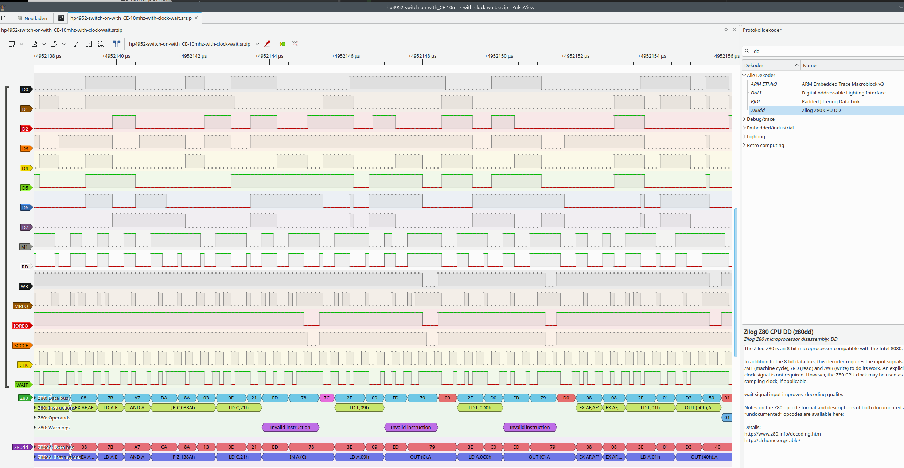
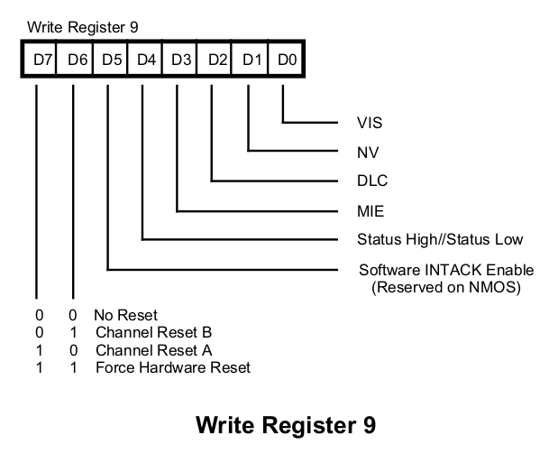

# Analysis of HP4952A code

This is work in progress. Not much is yet known.

### Application startup
Application file bytes uploaded by remore feature (and I suppose, also by loading it from disk),
are put to RAM address 0xa0000. This seems standard behaviour of HP4952A.

The application file contains several sections. 

Some of them are assembled to be executed at start addresses around 0xa0000 and larger. 
These are initial startup code parts for the application.

Some other parts of them are assembled to be executed at other RAM areas. So, the
startup code of the application (around 0xa0000 as said) includes memory copy
code that copies these sections to required locations in HP4952A RAM where they
can be executed. 

VT100 app contains a big part to be executed around 0x2000. This seems to be
a standard address, where the application code can be copied to, and then executed.

For VT100 app, I have defined a constant for the target address where code
is copied to and executed:
```asm
app_target_area:        equ     02a00h
```
It can be seen that e.g. all ```call``` op codes use addresses of the target area,
like 0x2acf . If this code would be executed at its initial location, without copying
it to app_target_area, it would fail.

### System Memory map


| Range           | Content                    |
|-----------------|----------------------------|
| 0x0000 - 0x7fff | Application RAM            |
| 0x8000 - 0xffff | U500 ROM lower 32KB        |
|                 | U500 ROM upper 32KB        |
| 0xa000 - ?      | Non-Application RAM 32KB   |
| ? - ?           | U502 ROM 64KB              |
| ? - ?           | U503 ROM 64KB              |
| ? - ?           | Data Capture RAM           |
| ? - ?           | RAM from Extension Options |

U500 clearly contains code.

Besides U500, there are also ROMs U502 and U503 
that look like they contain Z80 code (maybe boot+"OS" code)
They have each 64KB too.

There is also some non-application RAM, where e.g.
disk files are loaded into. This starts always at 
0xa000.

Finally, there is data capture RAM, and
maybe RAM from the RAM extension card (if present in a HP4952).

So memory map is complex.

### ROM content
There are various ROMs in the device, several on each of the boards.
Only a subset contains Z80 code.

Because there are also 8080,68000,87C51 CPUs built in the
HP4952A, some of the ROMs contain code for these CPUs.

At https://github.com/VintageProject/HP4952A, the ROM dumps are available.
I haven't dumped all my ROMs so far, but will do it later.

Of most interest are the ROMs on the RAM/ROM board.

These are mapped into the address space by an out opcode with a special 
address with some value.
Some decoding logic at the special address then will use the value to
select the correct RAM/ROM, and enable its ```Chip Enable``` pin. By doing
this, the CPU has access to more than 64KB, despite having only a 64KB
address space.

#### U500 chip
The ROM chip U500 looks interesting. It has 64KB size. Either its lower 32KB or
its upper 32KB can be mapped in at 0x8000.

This can be derived by examining its content. Both parts start with some
jump table (example for lower part):
```
	jp 08352h		;8000	c3 52 83 	. R . 
	jp 083d2h		;8003	c3 d2 83 	. . . 
	jp 083d8h		;8006	c3 d8 83 	. . . 
	jp 0843eh		;8009	c3 3e 84 	. > . 
	jp 08482h		;800c	c3 82 84 	. . .
```
And at e.g. 0x8352 or 0x83d2, we find real code.

Same for upper part, it has the jump table at offset 0 too:
```
	jp 00000h		;8000	c3 00 00 	. . . 
	jp 00000h		;8003	c3 00 00 	. . . 
	jp 011c6h		;8006	c3 c6 11 	. . . 
	jp 011bfh		;8009	c3 bf 11 	. . . 
	jp 08080h		;800c	c3 80 80 	. . . 
	jp 081b9h		;800f	c3 b9 81 	. . . 
	jp 08187h		;8012	c3 87 81 	. . .
```
Here it is interesting that the first two entries point to 0x0000,
supposed to be system reset. Entries 3 and 4 point to 0x1..., which
is supposed to be in RAM. 

#### U502
64KB ROM. also contain valid Z80 code.

It looks like this ROM contains boot code,
i.e. the "main appliation" running after switching on,
with main menu and the built-in apps for setup,
remote functionality, printing etc.


#### U503
64KB ROM. also contain valid Z80 code.

Looks like also boot code: floppy handling, self test, 


#### U204
This 32KB ROM seems to contain 68000 CPU code. These are the only strings to be found
in the ROM:
```
Error! Entry Mode=User
---Bus Error---#
---Address Error---#
---Illegal Instruction---#
---Zero Divide---#
---CHK Instruction---#
---TRAPV Instruction---#
---Privilege  Violation--- #
---Trace---#
---1010 Exception---
---1111 Exception---
Run Aborted! Mode=User
```

Example "1010 Exception", I found this somewhere in the Internet:

*Opcodes beginning with Hex 'A' (1010_xxxx_xxxx_xxxx) and Hex 'F' 
were traditionally used on the 68000 architecture to implement
coprocessors.
For example, the 680x0 family originally had a separate Floating 
Point processor. All opcodes for floating point operations had an 
'F' as the top nibble, and the 680x0 handed them off to the 
coprocessor for execution. If you tried to execute floating point 
code on a 680x0 processor without an FPU, you would get an 
"Unimplementd F-Line Opcode" exception.*


And that looks like some text strings in code
handling 68000 exceptions. So I suppose U204 contains
68000 code, but very low level functions.


#### U304
This chip is the 87C51 CPU, it contains also a 4KB ROM part,
with code for it.

### Data transfer to/from ports
In application code, many out/in calls can be seen.

#### Data transfer with SCC chip
By checking the schematics, SCC CE is driven by A14=15=1 (and IO/~M = 1). This means, if
SCC should be invoked, upper address byte of address bus need to be used.
(Detail: A15,A14 and IO/~M go into a AND gate, followed by inverter. So these signals
are combined by NAND function, is zero only if all inputs are high.)

Z80 allows 16 bit addressed ports using bc register, and an ``out (c),xxx`` call is required then. In that case,
b contains upper part of port address. 
For register b from bc register, then bit 0 (A14) and bit 1 (A15) are to be set.

What I did not find in vt100 app code, was a call using a 16 bit port address.

So I checked all the ROM code and found a single function doing that, in ROM U500.

Disassembled ROM:
[U500_04952-10028_MBM27C512-lower.BIN.dasm](ROMs/RAM-ROM%20Board/U500_04952-10028_MBM27C512-lower.BIN.dasm)

Code piece found:
```asm
    ; outputs to any port at address bc, a sequence of bytes. Ends with 0x00.
    ; all args in (hl)
    ; b from hl
    ; c from hl+1
    ; a from hl+2
	ld b,(hl)		;d369	46 	F 
	inc hl			;d36a	23 	# 
	ld c,(hl)		;d36b	4e 	N 
	inc hl			;d36c	23 	# 
ld36dh:
	ld a,(hl)		;d36d	7e 	~ 
	out (c),a		;d36e	ed 79 	. y 
	inc hl			;d370	23 	# 
	djnz ld36dh		;d371	10 fa 	. . 
	ret			;d373	c9 	. 
```

SCC also uses address bits 9 and 8 for D/~C and A/~B. 
So, addresses for SCC always look like Cx0x, Cx1x, Cx2x, Cx3x.

| A9 = D/~C | A8 = A/~B | Meaning                      |
|-----------|-----------|------------------------------|
| 0         | 0         | Control byte (command), PORTB |
| 0         | 1         | Control byte (command), PORTA |
| 1         | 0         | Data byte, PORTB   |
| 1         | 1         | Data byte, PORTA    |

##### fm_execute call chain
```asm
    ; function called by menu selection
    ; c331 function; "Execute" from main menu
fm_execute:
	ld a,062h		;c331	3e 62 	> b             ; (07501h):=0x62
	ld (07501h),a		;c333	32 01 75 	2 . u   ;
	ld a,006h		;c336	3e 06 	> .             ; Load Page 6 (Application RAM)
	call os_loadpage		;c338	cd 60 0e 	. ` .       ; Patched to 02d02h, Page-in 6
	call 0a54bh		;c33b	cd 4b a5 	. K .       ; maybe code in U503 at loc a54b, (or U502 but 503 looks more realistic)
	ld a,022h		;c33e	3e 22 	> "             ; (07501h):=0x22
	ld (07501h),a		;c340	32 01 75 	2 . u   ;
	ld a,(_tmp_page)		;c343	3a 96 a4 	: . . ; a:=tmp_page
	call os_loadpage		;c346	cd 60 0e 	. ` .       ; Patched to 02d02h, Page-in _tmp_page
	ld hl,00001h		;c349	21 01 00 	! . .   ; hl:=1
	ret			;c34c	c9 	. 
```

(07501h) is being loaded with these values: 0x21, 0x22, 0x62.
fm_execute() is the only place where 0x62 is loaded into 07501h.

fm_execute is forwarding to a54bh. I suppose this is code in ROM U503.
```asm
	; POI-220: could be entry point for VT100 Execute code at fm_execute in vt100.asm
	; contains no loop
la54bh:
	ld d,(hl)		;a54b	56 	V 
	ld (07b73h),de		;a54c	ed 53 73 7b 	. S s { 
	call sub_a5bah		;a550	cd ba a5 	. . . 
	call sub_a5d6h		;a553	cd d6 a5 	. . . 
	ld hl,(07b73h)		;a556	2a 73 7b 	* s { 
	inc hl		        ;a559	23 	# 
	inc hl		        ;a55a	23 	# 
	ld (07b73h),hl		;a55b	22 73 7b 	" s { 
	call sub_a5bah		;a55e	cd ba a5 	. . . 
	ld de,l0008h+2		;a561	11 0a 00 	. . . 
	ld hl,(l7b69h)		;a564	2a 69 7b 	* i { 
	add hl,de		;a567	19 	. 
	ld e,(hl)		;a568	5e 	^ 
	inc hl		        ;a569	23 	# 
	ld d,(hl)		;a56a	56 	V 
	ld (07b73h),de		;a56b	ed 53 73 7b 	. S s { 
	inc de		        ;a56f	13 	. 
	inc de		        ;a570	13 	. 
	ld (07b73h),de		;a571	ed 53 73 7b 	. S s { 
	ld a,(07b67h)		;a575	3a 67 7b 	: g { 
	cp 00fh		        ;a578	fe 0f 	. . 
	jr nz,la583h		;a57a	20 07 	  . 
	ld a,004h		;a57c	3e 04 	> . 
	ld (07b67h),a		;a57e	32 67 7b 	2 g { 
	jr la588                ;a581	18 05 	. . 
la583h:
	ld a,008h		;a583	3e 08 	> . 
	ld (07b67h),a		;a585	32 67 7b 	2 g { 
la588h:
	ld de,l0006h		;a588	11 06 00 	. . . 
	ld hl,(l7b69h)		;a58b	2a 69 7b 	* i { 
	add hl,de		;a58e	19 	. 
	ld (l7b79h+2),hl	;a58f	22 7b 7b 	" { { 
	ld hl,(07b73h)		;a592	2a 73 7b 	* s { 
	ld e,(hl)		;a595	5e 	^ 
	inc hl		        ;a596	23 	# 
	ld d,(hl)		;a597	56 	V 
	ld hl,(07b67h)		;a598	2a 67 7b 	* g { 
	add hl,de		;a59b	19 	. 
	ld de,l0019h		;a59c	11 19 00 	. . . 
	ex de,hl		;a59f	eb 	. 
	call sub_1767h		;a5a0	cd 67 17 	. g . 
	inc hl	       	        ;a5a3	23 	# 
	inc hl			;a5a4	23 	# 
	ex de,hl		;a5a5	eb 	. 
	ld hl,(l7b79h+2)	;a5a6	2a 7b 7b 	* { { 
	ld (hl),e		;a5a9	73 	s 
	inc hl		        ;a5aa	23 	# 
	ld (hl),d		;a5ab	72 	r 
la5ach:
	ld hl,(l7b69h)		;a5ac	2a 69 7b 	* i { 
	ld e,(hl)		;a5af	5e 	^ 
	inc hl		        ;a5b0	23 	# 
	ld d,(hl)		;a5b1	56 	V 
	ld (l7b69h),de		;a5b2	ed 53 69 7b 	. S i { 
	jp sub_a4d7h		;a5b6	c3 d7 a4 	. . . 
la5b9h:
	ret		        ;a5b9	c9 	. 
```

After several approaches to get a clue whats going on, by following all subroutines and
jumps spawning of from this function, I gave up. Without almost any hint or documentation
regarding the system it would last forever to get a grip on that task.

Because I also have a Kingst LA5032 logic analyzer in my toolbox, I tried to do some 
hardware analysis to move forward.

After first approach analyzing the signals at SCC itself, I moved to analysis of the
Z80 CPU itself, and there were first real results.

## Hardware analysis with logic analyzer
I own a nice Kingst LA5032 logic analyzer. it offers 32 ports and up to 500Mhz sample rate
with virtually "infinite" sample depth, hundreds of Gigasamples are possible, this could be minutes
of data captures from a e.g. 10Mhz bus. So it is a very powerful device.

There is also sigrok+pulseview, a great open source software for Linux, that can access
a large number of logic analyzers, oscilloscopes and other measurement devices of all kinds.
While sgirok offers a cli, pulseview is a graphical UI for sigrok.

Sigrok supports the Kingst LA5032, this was one of main reasons for me to buy that product.

I also ordered some used Pomona (and 3M) IC tester clips before, including a 40 pin clip.
So I have all at hands to hook on directly to the Z80 CPU and look at its signals.

Some friendly guys even have written a Z80 decoder for sigrok/pulseview. This decoder has 
bugs, but is even with bugs a great help in understanding what the HP4952A is doing.

So I hooked up the logic analyzer to the HP4952A. Close to the Z80 (Toshiba TMP84C00)
there is an XTal with  7.3728Mhz. I suppose that this is part of clock oscillator
for the Z80. From logic analyzer I see roughly 400ns / 2.5Mhz for a full clock cycle.
So this is somehow strange. 

When switching on, the SCC is initialized. I have the following config for detailled analysis:
* All signals supported by Z80 decoder hooked up. These are:
  * D0-D7
  * M1
  * RD, WR
  * MREQ, IOREQ
* SCC Chip Enable CE pin
* Clock signal at Z80 pin 6
* Wait signal at Z80 pin 24 (added later, see below)

I can now locate accesses to the SCC Chip (then CE goes low). The next large screenshot
shows more or the first call to SCC chip done by HP4952A after switching on.



In the screenshot, all pins can be seen. Also decoder output, see the four "Z80" lines (Data bus, Instructions,
Operands, Warnings). The original code of the decoder has an issue decoding out and in opcodes and also
at fetching opcodes from RAM. In my case, the external chips and RAM are not fast enough for immediate response
and assert the /WAIT pin. This is ignored by the original z80 decoder, resulting in wrong decodings,
sometimes even "Invalid instruction" is dumped out.

After having studied the source code of the z80 decoder, written in Python, I was able to fix this issue at least
partly. Check the two lines at the bottom of screenshot. These are the decodings from the fixed decoder.
No "invalid instructions" anymore, and the decoding in general looks much more correct. 
I suppose the original decoder works well on a system with slow CPU, where RAM and external devices maybe do 
not assert /WAIT at all.

But coming back to my goal, we have a nice dump of the first access to SCC now.
it looks like this, I added comments:
```asm
...
LD  C,21h       ; seems to be output port number of SCC
IN  A,(C)       ; read from SCC, I guess this returns RR0 (read register 0), result seems to be ignored
LD  A,09h       ; select register (W)R9
OUT (C),A       
LD  A,0C0h      ; write out value 0x0c to selected register
OUT (C),A       ;
...
```

And what means "write out value ```0xc0``` to selected register" ? Lets check Zilogs SCC user manual, page 167:



So 0xc0 = 1100.0000, meaning command "Force Hardware Reset". Which makes totally sense, to initialize the chip
after being switched on, before any further use.

With this piece of code, we can do a search in the disassembled ROMs. And there is a match, in ROM U204.
file U204_04952-10029_TMS27C256.BIN.dasm . Code piece is:
```asm
...
	jp 00063h		;1387	c3 63 00 	. c . 
	
; here we go, code piece from above:	
	ld c,021h		;138a	0e 21 	. ! 
	in a,(c)		;138c	ed 78 	. x 
	ld a,009h		;138e	3e 09 	> . 
	out (c),a		;1390	ed 79 	. y 
	ld a,0c0h		;1392	3e c0 	> . 
	out (c),a		;1394	ed 79 	. y 
; end of matched code piece
	
	ex af,af'			;1396	08 	. 
	ex af,af'			;1397	08 	. 
	ld a,001h		;1398	3e 01 	> . 
	out (040h),a		;139a	d3 40 	. @
    ; maybe SCC Port A,Control	, probability 5%
	ld b,001h		;139c	06 01 	. . 
	ld e,000h		;139e	1e 00 	. . 
	ld c,021h		;13a0	0e 21 	. ! 
	ld d,00ch		;13a2	16 0c 	. . 
	ld a,d			;13a4	7a 	z 
	out (c),a		;13a5	ed 79 	. y 
...
```
I kept in the copy above an old comment from me from two weeks ago, where I was checking ROM content code-wise.
There I was also considering that area as maybe related to SCC handling, but without any level of certainty.

## Further reading

* SCC/ESCC User Manual TBD