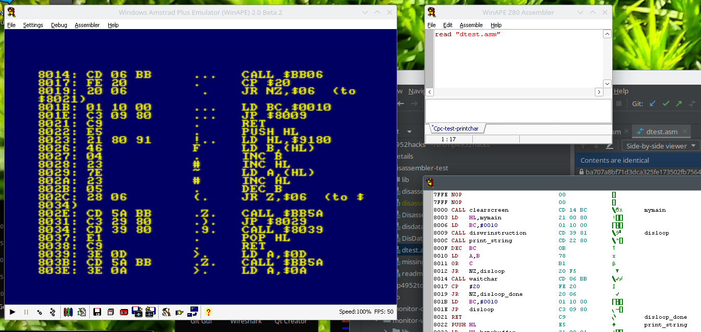

# Disassembler code integration test PoC
I want to integrate disassembling functionality in 
my variant of Vaxmans monitor code. This variant
is targeted to HP4952A hardware. 

This directory contains my effort to extract disassembler
code from another project and to make it usable for
the monitor.

Screenshot of PoC code in WinAPE. Disassembles next 0x10
opcodes and then waits for a key. On Space, next 0x10 opcodes
are disassembled. Any other key ends disassembly routine.

## Origin of disassembler source
The Z80 disassembler code, written in Z80 
assembler, comes from SCM (Small
Computer Monitor) package.

The whole disassembler comes in three files:
* disassembler.asm (coming from original name Disassembler.asm)
* disdata.asm (coming from original name DisData.asm)
* missing.asm. This file is a collection of all code
  pieces from SCM software referenced by the 
  disassembler code. They are from numerous files.

# See also
* Small Computer Monitor Site - https://smallcomputercentral.com/small-computer-monitor/
* Monitor source code from http://www.vaxman.de/projects/tiny_z80/ .
